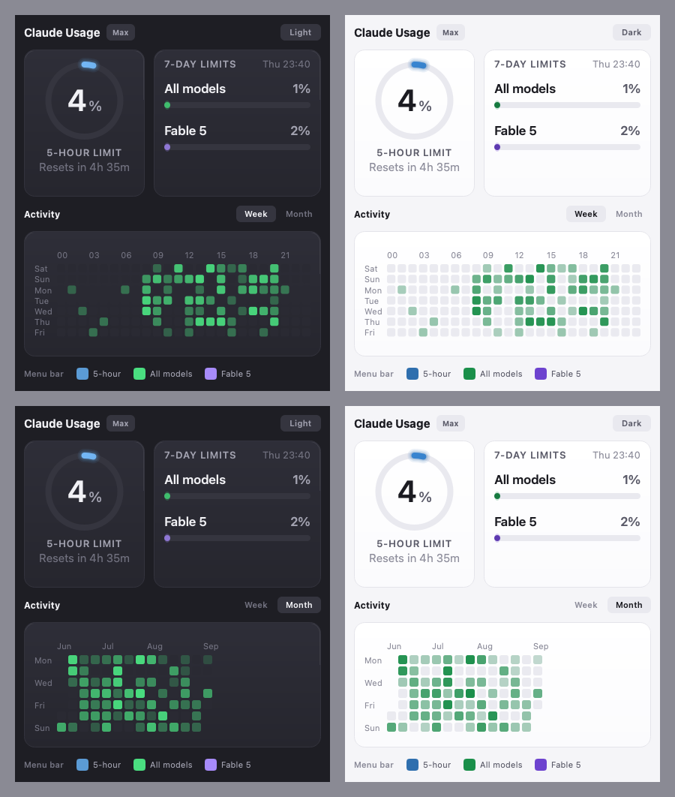
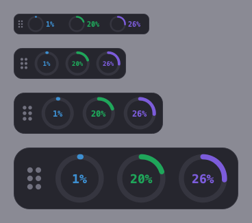
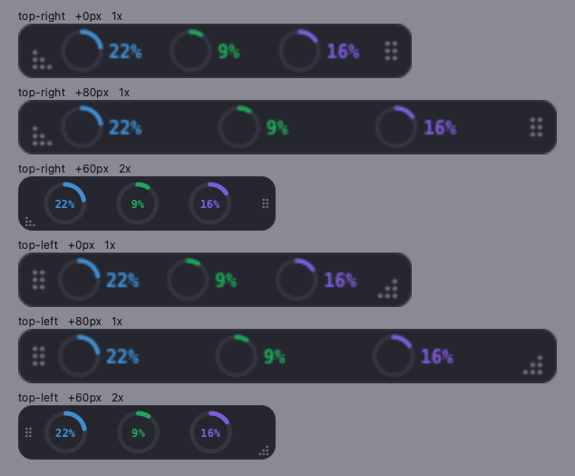
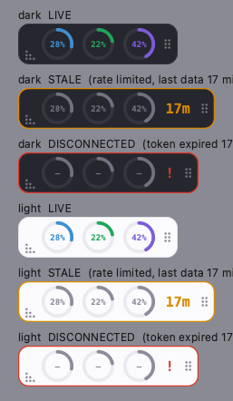

# Claude Usage Widget — macOS menu-bar edition

**By Stefanie Herzer, at [heART](https://heartapps.app).**

A small always-on desktop widget that shows your **Claude Code plan usage** — the 5-hour session limit, the 7-day limit, and the per-model weekly cap — as three dials in a strip that can live *in* your macOS menu bar, with a card-based panel one click away.

It is a fork of [bozdemir/claude-usage-widget](https://github.com/bozdemir/claude-usage-widget) (MIT), which does the hard work of reading Claude Code's local session data and its usage endpoint. This fork adds the menu-bar strip, the panel, light and dark themes, a window-style resize, and a set of data-path fixes learned the hard way. Everything upstream offers (bars, gauges, skins, cost ticker, heatmaps) is still here — see [the upstream README](docs/UPSTREAM-README.md).





## What this fork adds

- **The strip.** A 30 px pill with three dials — 5-hour, All models, and the model-scoped weekly cap (currently "Fable"). Hue is the label: blue, green, violet, turning amber and red as a cap fills. Numbers sit beside the rings and move inside them once there is room.
- **In the menu bar.** With `strip_in_menubar` on, the strip floats above the macOS menu bar and the *Top Right* preset parks it in the bar band. Off by default, because it floats over real status items rather than among them.
- **A real resize.** Drag the corner grip like a window: width and height are independent, the opposite corner stays fixed, the content reflows. The handles are fixed-size chrome; only the dials scale.
- **The panel.** Ring card, 7-day limits card, a Week/Month activity grid computed from real per-hour data, toggles for which dials the menu bar shows, and a Light/Dark switch the strip follows.
- **Data-path fixes.** The widget now honors `Retry-After` (previously it could lock itself out of the usage endpoint indefinitely), and the quota-spending AI weekly summary can be switched off. See [Troubleshooting](docs/TROUBLESHOOTING.md) for the full story of why bars go blank.



## Install (macOS)

Requirements: Python 3.10 or newer, and the [Claude Code](https://docs.anthropic.com/en/docs/claude-code) CLI signed in to a Claude subscription (`claude auth login --claudeai`). The widget reads the same OAuth token the CLI uses; it never has credentials of its own.

```bash
git clone https://github.com/herzer/claude-usage-widget.git
cd claude-usage-widget
python3 -m venv .venv
.venv/bin/pip install -e '.[menubar]'      # [menubar] adds PyObjC for the menu-bar float
.venv/bin/claude-usage --detach            # background; logs in ~/.cache/claude-usage/widget.log
```

Put `.venv/bin/claude-usage` on your `PATH` (a symlink into `~/.local/bin` works) and it is just `claude-usage`.

**Start at login:** `./setup-autostart.sh` writes and loads a LaunchAgent — and refuses to, until it has seen your plan data actually flow, so you never autostart a widget that shows nothing. This also keeps the widget alive when the shell that launched it exits.

## Using it

| Action | Effect |
|---|---|
| Left-click the strip | Open the panel |
| Drag the dot handle (or anywhere on it) | Move |
| Drag the corner grip | Resize — exactly like a window |
| Scroll over it | Scale in steps |
| Right-click | Menu: view (Bars / Gauge / Strip), position, opacity, theme, *Strip in menu bar*, always on top, quit |

In the panel: **Week / Month** switches the activity grid; the **Light / Dark** button restyles the panel *and* the strip; the checkboxes at the bottom choose which dials the optional menu-bar tray icon shows.

## Configuration

`~/.config/claude-usage/config.json`, created on first change. Prefer the right-click menu; edit the file only while the widget is stopped, because it writes its in-memory config on exit. Keys this fork adds, with defaults:

| Key | Default | Meaning |
|---|---|---|
| `osd_view_mode` | `"bars"` | `"bars"`, `"gauge"`, or `"strip"` |
| `strip_in_menubar` | `false` | Float the strip above the macOS menu bar |
| `osd_strip_width` | `0` | Strip width from the grip; `0` fits the content |
| `panel_style` | `"heart"` | `"heart"` (cards) or `"classic"` (upstream popup) |
| `panel_dark` | `true` | Panel and strip appearance |
| `menubar_enabled` | `true` | Optional tray-icon dials (separate from the strip) |
| `menubar_show_session`, `_all`, `_scoped` | `true` | Which tray dials to draw |
| `weekly_report_enabled` | `true` | The AI weekly summary — the only feature that spends plan quota |
| `refresh_seconds` / `refresh_max_seconds` | `60` / `300` | Poll cadence and backoff cap; `Retry-After` overrides both |
| `stale_after_seconds` | `600` | Silence before surfaces show **stale** |
| `notify_stale_after_seconds` | `600` | Stale duration before a desktop notification |
| `auth_refresh_via_cli` | `true` | On 401, renew the token with one tiny `claude -p` call |

## When it cannot reach the API

The widget keeps showing the last numbers it got — but never as if they were current. Every surface renders one of three states:



| State | What you see | What it means |
|---|---|---|
| **Live** | Normal colors | The last poll succeeded recently |
| **Stale** | Gray rings, dimmed numbers, amber border, an age badge (`17m`) | A poll failed (usually rate limiting) or nothing fresh has arrived for `stale_after_seconds`; it retries on its own |
| **Disconnected** | Red border, dashes instead of numbers, a red `!` | Waiting cannot help: the token is expired, missing, or lacks permission. The panel's status line and the tooltip say exactly what to run |

The panel's status line always shows the time since the last *successful* fetch, and the menu's footer says "STALE — last data 17 hours 24 minutes ago" rather than pretending. A desktop notification fires when it disconnects (with the fix), when it has been stale for ten minutes, and when it reconnects.

**It heals itself.** The Claude Code CLI only renews its OAuth token when *it* makes an API call — if you work in the desktop app, the token the widget reads lapses roughly eight hours after you sign in. On a 401 the widget therefore makes one tiny authenticated CLI call (`claude -p`, one turn, a few dozen tokens, at most once per fifteen minutes), which renews the token in place. Set `auth_refresh_via_cli` to `false` if you would rather it only warned.

## Blank bars?

The widget shows `--%` or `0%` in three different situations that look identical on screen. Read the actual error before touching anything:

```bash
.venv/bin/claude-usage --once | python3 -c "import sys,json; d=json.load(sys.stdin); print(d['rate_limit_error'], d.get('retry_after_seconds'))"
```

| It says | It means | Do |
|---|---|---|
| `No credentials …` | No token found | Sign in: `claude auth login --claudeai` |
| `Credentials expired …` | HTTP 401 — the CLI's session is expired, refresh token included | Sign in again; nothing else can renew it |
| `Rate limited …` | HTTP 429 — and it sits *on top of* a 401, hiding it | **Wait.** The endpoint's budget is tiny and the penalty escalates with every request |
| `OAuth usage error 403` | A `claude setup-token` token — it lacks this endpoint's scope | Use the interactive sign-in instead |

**Do not poll in a loop while diagnosing.** One request, then wait; the full reasoning is in [docs/TROUBLESHOOTING.md](docs/TROUBLESHOOTING.md).

## Development

```bash
.venv/bin/pip install -e '.[menubar]' pytest
QT_QPA_PLATFORM=offscreen .venv/bin/python -m pytest tests/ -q     # ~500 tests
.venv/bin/python tools/preview.py out.png --view strip --scale 2    # offscreen render
.venv/bin/python tools/panel_preview.py out.png                     # panel, dark | light
.venv/bin/python tools/live_mock.py                                 # real windows, mock data, zero API calls
launchctl kickstart -k gui/$(id -u)/local.claude-usage-widget        # restart the autostarted widget after edits
```

The live mock exists because look-and-feel rounds must not cost polls on a rate-limited endpoint, and offscreen renders use a substitute font that hides text clipping until it is on a real display. [CLAUDE.md](CLAUDE.md) has the pick-up notes.

## Credits and license

The menu-bar edition is by **Stefanie Herzer** at [**heART**](https://heartapps.app), built on [claude-usage-widget](https://github.com/bozdemir/claude-usage-widget) by Burak Özdemir, MIT. This fork is MIT as well — see [LICENSE](LICENSE). Not affiliated with Anthropic.
